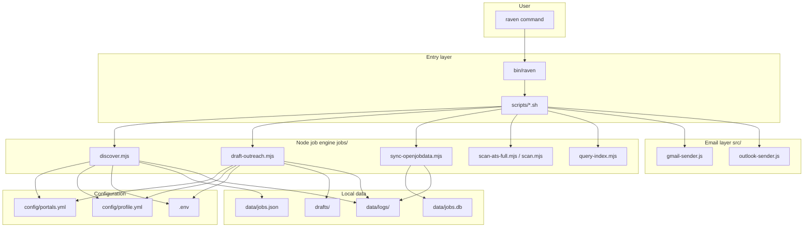

# Architecture

Raven is a **local-first CLI** for job search automation. It has three layers: shell entrypoint, bash scripts, and a Node.js job engine.

---

## High-level diagram

---

## Layer 1 — CLI entry (`bin/raven`)

**File:** `bin/raven`

| Responsibility | Detail |
|----------------|--------|
| Resolve repo root | Follows symlinks (fixes `npm link` pointing at Homebrew) |
| Dispatch commands | Maps `discover`, `draft`, `send`, … → `scripts/<name>.sh` |
| Help text | Built-in `--help` for top-level usage |

Environment exported:

| Variable | Value |
|----------|-------|
| `RAVEN_ROOT` | Absolute path to repo root |
| `SCRIPTS_DIR` | `$RAVEN_ROOT/scripts` |

Aliases accepted: `scan:ats` → `scan-ats`, `auth:gmail` → `auth-gmail`, `query-index` → `query`.

---

## Layer 2 — Bash scripts (`scripts/`)

Thin wrappers that:

1. Source `_lib.sh` (paths, `.env`, dependency checks)
2. Run `node jobs/<module>.mjs` or `node scripts/<helper>.js`

See [scripts/README.md](scripts/README.md).

---

## Layer 3 — Node job engine (`jobs/`)

ESM modules (`.mjs`) containing all job logic:

| Module | Role |
|--------|------|
| `discover.mjs` | Parallel tier orchestration, dedup, save |
| `draft-outreach.mjs` | Resume parse + tailor + CSV/MD output |
| `sync-openjobdata.mjs` | HuggingFace → SQLite index |
| `scan-ats-full.mjs` | Live reverse-scan of 12 ATS platforms |
| `scan.mjs` | Board feeds + optional company scan |
| `query-index.mjs` | Search `data/jobs.db` |
| `lib/*` | Shared filters, dedup, profile, resume, logging |
| `providers/*` | Per-platform HTTP fetchers |
| `plugins/gemini-draft.mjs` | Optional AI email polish |

---

## Layer 4 — Email (`src/` + root scripts)

CommonJS modules used only by `raven send`:

| File | Purpose |
|------|---------|
| `src/gmail-auth.js` | OAuth refresh → access token |
| `src/gmail-sender.js` | Gmail API `messages/send` |
| `src/outlook-auth.js` | Microsoft token refresh |
| `src/outlook-sender.js` | Graph API `me/sendMail` |
| `scripts/send-prewritten.js` | Read CSV/XLSX, send rows |
| `setup-gmail-auth.js` | One-time Gmail OAuth flow |
| `setup-outlook-auth.js` | One-time Outlook OAuth flow |

---

## Configuration sources

| Priority | Source | Used by |
|----------|--------|---------|
| 1 | CLI flags | discover, draft, scan, query |
| 2 | `config/portals.yml` | discover (default filters) |
| 3 | `config/profile.yml` | draft (identity, templates, resume path) |
| 4 | `.env` | send (OAuth), optional API keys |
| 5 | `config/outreach.yml` | draft fallback (legacy) |

CLI flags **extend or override** YAML — they do not silently ignore config. See [config/portals.md](config/portals.md).

---

## Data flow summary

| Stage | Input | Output |
|-------|-------|--------|
| **Discover** | Filters + ATS/board/index APIs | `data/jobs.json` |
| **Draft** | `data/jobs.json` + profile + resume | `drafts/outreach-*.{csv,md}` |
| **Send** | CSV with `contact_email` | Gmail/Outlook delivery |

Form-application rows skip send — user follows `form_steps` in browser.

---

## Dependencies

| Package | Location | Purpose |
|---------|----------|---------|
| Root `package.json` | repo root | `csv-parse`, `csv-stringify`, `dotenv`, `xlsx` |
| `jobs/package.json` | `jobs/` | `pdf-parse`, `yaml`, HTTP clients |
| Node.js | system | **18+** required |

Install via `raven setup` → `npm install` in root and `jobs/`.

---

## What Raven is not

- Not a hosted SaaS — everything runs on your machine
- Not a browser automation tool for applying (form guides are copy/paste instructions)
- Not connected to `ops/` — that folder is a separate reference project, not imported by Raven CLI

---

## Related docs

- [Pipeline](PIPELINE.md) — step-by-step workflow
- [File layout](FILE_LAYOUT.md) — every path
- [jobs/README.md](jobs/README.md) — engine internals
