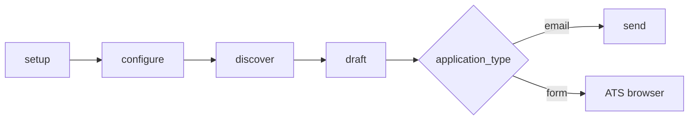
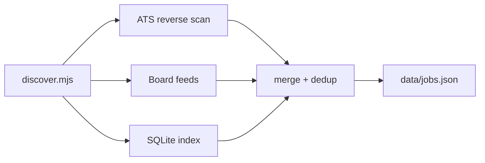

# Pipeline

End-to-end workflow: **Discover → Draft → Send** (send is optional).

---

## Overview



---

## Phase 0 — Setup

```bash
./raven setup
```

Creates `.env`, `config/*.yml`, `files/resume.md` from examples. See [cli/setup.md](cli/setup.md).

---

## Phase 1 — Configure

| File | Purpose |
|------|---------|
| `config/profile.yml` | Identity, links, outreach templates |
| `files/resume.md` | Parsed resume bullets |
| `config/portals.yml` | Search filters |
| `.env` | Sender + OAuth (for send) |

---

## Phase 2 — Discover

```bash
./raven discover --q "software engineer" --since 7
```

Saves to `data/jobs.json`. See [cli/discover.md](cli/discover.md).

### What happens under the hood



| Tier | Source | Prep |
|------|--------|------|
| ATS | 12 platforms × N companies via public APIs | None |
| Boards | RemoteOK, Remotive, Arbeitnow, Landing.jobs | None |
| Index | `data/jobs.db` from openjobdata | `raven sync-jobs` |

**Not included:** Google/WebSearch (`search_queries` in portals.yml is config-only today).

Deep dive: [jobs/discovery-deep-dive.md](jobs/discovery-deep-dive.md)

---

## Phase 3 — Draft

```bash
./raven draft --max 25
```

Writes `drafts/outreach-*.csv` and `.md`. See [cli/draft.md](cli/draft.md).

Deep dive: [jobs/draft-deep-dive.md](jobs/draft-deep-dive.md) — email vs form, tailoring, Gemini opt-in.

---

## Phase 4 — Review

Edit CSV or read Markdown before any send or ATS submit.

---

## Phase 5 — Send or apply

| Type | Action |
|------|--------|
| `email` | `raven send --dry-run` then `raven send` |
| `form` | Follow `form_steps` in browser |

See [cli/send.md](cli/send.md) and [drafts/README.md](drafts/README.md).
