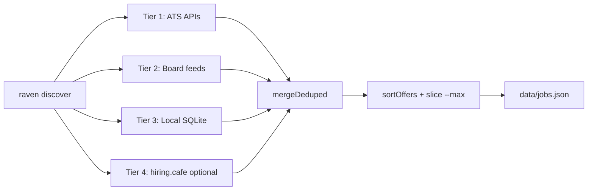

# Discovery deep dive

How Raven finds jobs — architecture, data flow, and implementation truth.

**Entry point:** `jobs/discover.mjs`  
**CLI:** `raven discover`  
**Output:** `data/jobs.json`

---

## TL;DR

`raven discover` does **not** perform open-web search (Google, Bing, etc.). It runs up to four **parallel tiers** that pull structured job data from public APIs and feeds, applies title/location filters client-side, deduplicates by canonical apply URL, and saves normalized offers to JSON.



---

## What "search" means in Raven

| Mechanism | How listings are found | In `discover` default? |
|-----------|------------------------|------------------------|
| **ATS reverse scan** | HTTP GET/POST to each company's public ATS JSON API | Yes (`--sources ats`) |
| **Board feeds** | Single HTTP call per aggregator (RemoteOK, Remotive, …) | Yes (`--sources boards`) |
| **openjobdata index** | SQL query on local `data/jobs.db` | Yes (`--sources index`, needs sync) |
| **hiring.cafe** | POST to their search API (or Apify fallback) | Opt-in (`HIRING_CAFE_ENABLED=1`) |
| **WebSearch / `search_queries`** | Google-style `site:` queries | **Not implemented** — config only |
| **`scan_method: websearch`** | Per-company search handoff | **Handoff log only** — no auto results |

The discover pipeline is **zero LLM, zero browser** by default. Pure HTTP + JSON (+ SQLite for index tier).

---

## Orchestrator algorithm

`discover.mjs` exports `discover(filters, logger, opts)`:

1. **parseArgs** — CLI flags (`--q`, `--sources`, `--since`, …)
2. **resolveDiscoverFilters** — merge with `config/portals.yml` via `jobs/lib/portals.mjs`
3. **Spawn parallel tasks** (one per enabled `--sources` value):
   - `ats` → child process `scan-ats-full.mjs --dry-run --json`
   - `boards` → child process `scan.mjs --dry-run --boards-only --json`
   - `index` → in-process `queryIndex()` (skipped if `data/jobs.db` missing)
   - `hiringcafe` → in-process `providers/hiring-cafe.mjs`
4. **mergeDeduped** — union all tier arrays, first wins per canonical URL
5. **sortOffers** — `postedAt` descending, then `company` name
6. **slice** to `--max` (default 1000)
7. **saveDiscoverResults** → `data/jobs.json` (unless `--no-save`)

Child processes (ATS, boards) receive filters through a **temp portals YAML**:

```
$TMPDIR/raven-discover-<uuid>.yml
```

Env var `RAVEN_PORTALS` points at that file. Cleaned up after the run.

---

## Tier 1 — Live ATS reverse scan

**Module:** `jobs/scan-ats-full.mjs`  
**Flag:** `--sources ats`

### Inversion vs. company scan

| `scan.mjs` (company scan) | `scan-ats-full.mjs` (reverse scan) |
|-----------------------------|-------------------------------------|
| You list companies in `portals.yml` | Raven walks **public company directories** per ATS |
| Fetches each `tracked_companies` entry | Builds synthetic `PortalEntry` from slug |
| Good for watchlist | Good for **broad discovery** without curation |

### Company directory sources

1. **Cached slugs** — `data/cache/ats-companies/` (populated by `raven sync-jobs`, 24h TTL)
2. **GitHub dataset** — [Feashliaa/job-board-aggregator](https://github.com/Feashliaa/job-board-aggregator) raw JSON per platform
3. **VC portfolio seeds** — optional `--seeds` (YC, etc.) via `jobs/seeds/vc-portfolios.mjs`

### Per-company flow

```
slug from directory
  → build careers_url (e.g. job-boards.greenhouse.io/{slug})
  → SSRF guard: SLUG_RE + entryOnHost() hostname check
  → provider.fetch(entry, ctx)  // e.g. boards-api.greenhouse.io/v1/boards/{slug}/jobs
  → classifyPostingDate vs --since cutoff
  → titleFilter + locationFilter (from portals.yml)
  → dedup seenUrls
  → push to offers[]
```

**Concurrency:** 20 parallel HTTP requests per ATS platform.

**12 platforms:** `greenhouse`, `lever`, `ashby`, `workday`, `rippling`, `workable`, `bamboohr`, `smartrecruiters`, `recruitee`, `pinpoint`, `teamtailor`, `personio`.

**Default cap:** `--limit 150` companies per platform (50–500).

### Example: Greenhouse provider

```javascript
// jobs/providers/greenhouse.mjs
// Detects slug from careers_url or uses explicit api: field
// GET https://boards-api.greenhouse.io/v1/boards/{slug}/jobs
```

No authentication. Public boards API.

### Stale / undated postings

Reverse scan **skips stale postings** when `postedAt` is known and older than `--since`. Undated postings are dropped by default (configurable with `--include-undated` on `scan-ats`).

Rationale: without dates, a full directory walk would flood results with ancient listings.

---

## Tier 2 — Board feeds

**Module:** `jobs/scan.mjs --boards-only`  
**Flag:** `--sources boards`

Fetches **entire public feeds** from aggregator APIs, then applies title/location filters client-side.

| Provider | Endpoint | Notes |
|----------|----------|-------|
| `remoteok` | `remoteok.com/api` | ~100 recent jobs |
| `remotive` | `remotive.com/api/remote-jobs` | Full feed; no `?search=` (too narrow) |
| `arbeitnow` | `arbeitnow.com/api/job-board-api` | Paginated |
| `landingjobs` | `landing.jobs/api/v1/jobs` | EU-focused |

Configured in `config/portals.yml` → `job_boards[]` with `provider:` key.

**Why client-side filter?** Board APIs often have weak server-side search. Raven pulls the feed and runs the same `buildTitleFilter` / `buildLocationFilter` as ATS tier.

---

## Tier 3 — Local openjobdata index

**Module:** `jobs/query-index.mjs`  
**Flag:** `--sources index`  
**Prep:** `raven sync-jobs` → `data/jobs.db`

SQLite from [openjobdata.com](https://openjobdata.com). Query:

```sql
SELECT j.apply_url, j.title, j.posted_at, c.name AS company, ...
FROM jobs j LEFT JOIN companies c ON ...
WHERE j.status = 'active' AND j.posted_at >= @cutoff
ORDER BY j.posted_at DESC LIMIT @limit
```

Title/location filters applied in JavaScript after SQL (over-fetch `limit * 4` then filter).

**When useful:** Offline search, broader historical coverage, ATS subset via `--ats`.

Set `HF_TOKEN` in `.env` if sync returns HTTP 401.

---

## Tier 4 — hiring.cafe (optional)

**Module:** `jobs/providers/hiring-cafe.mjs`  
**Flag:** `--sources hiringcafe`  
**Requires:** `HIRING_CAFE_ENABLED=1`

POST to `https://hiring.cafe/api/search-jobs`. May be blocked from datacenter IPs (Cloudflare). Optional Apify actor fallback via `APIFY_TOKEN`.

All results: `verification: unconfirmed`.

---

## Filtering pipeline

Filters apply **after fetch, before dedup** (per tier). Shared module: `jobs/lib/filters.mjs`.

### Title

- ≥1 `positive` keyword must match title (case-insensitive substring)
- 0 `negative` keywords may match
- Empty `positive` → all titles pass

### Location (check order)

1. Empty location on job → **pass**
2. Any `always_allow` match → **pass**
3. Any `block` match → **reject**
4. `allow` empty → **pass**
5. `allow` non-empty → must match ≥1

### Recency (`--since N`)

Jobs without parseable `postedAt` **pass** (conservative). Known dates older than N days → excluded.

Config mapping: [config/portals.md](../config/portals.md) · [filters.md](filters.md)

---

## Deduplication

**Module:** `jobs/lib/dedup.mjs`

`canonUrl(url)` normalizes before comparison:

- Lowercase hostname
- Strip `utm_*`, `ref`, etc.
- Remove trailing slash

`mergeDeduped(tierA, tierB, tierC)` — first occurrence wins across tiers.

Output counts:

| Field | Meaning |
|-------|---------|
| `rawMatches` | Sum of tier results before cross-tier dedup |
| `deduped` | `rawMatches - unique count` |
| `count` | Final offers after `--max` cap |

---

## Output shape

Each offer (`toDiscoveredOffer`):

```json
{
  "url": "https://job-boards.greenhouse.io/acme/jobs/123",
  "company": "Acme",
  "title": "Backend Engineer",
  "location": "Remote",
  "postedAt": "2026-07-04",
  "ats": "greenhouse",
  "source": "greenhouse-full"
}
```

Full schema: [data/jobs-json.md](../data/jobs-json.md)

---

## Web search: documented but not automated

`config/portals.example.yml` describes a 4-level strategy where level 3 is **WebSearch with `site:` filters**. Two config surfaces exist:

### `search_queries`

```yaml
search_queries:
  - name: Ashby — AI Engineer
    query: 'site:jobs.ashbyhq.com "AI Engineer" remote'
    enabled: true
```

**Status:** No code in `jobs/` reads or executes `search_queries`. Documented for future use or manual/agent workflows.

### `scan_method: websearch` on `tracked_companies`

When `scan.mjs` cannot resolve a zero-token HTTP provider for a company, and `scan_method === 'websearch'`:

```javascript
// jobs/scan.mjs — handoff only, no search execution
agentHandoff.push({
  company: entry.name,
  method: 'websearch',
  query: entry.scan_query || entry.search_query || entry.careers_url || '',
});
```

At end of scan, Raven **prints** these as "Agent/WebSearch handoff" hints. No results enter `data/jobs.json` from this path.

See [scan-strategies.md](scan-strategies.md) for the full strategy matrix.

---

## Interview-style Q&A

**Q: Why spawn child processes for ATS/boards instead of importing modules?**  
A: Isolation and reuse. `scan-ats-full.mjs` and `scan.mjs` are standalone CLIs with their own stdout JSON contract. Discover passes filters via temp YAML + `RAVEN_PORTALS` without duplicating their main loops.

**Q: Why parallel tiers instead of sequential?**  
A: Latency. ATS scan can take minutes (thousands of companies). Boards and index are fast. `Promise.all` on tier tasks minimizes wall-clock time.

**Q: What happens if `data/jobs.db` is missing?**  
A: Index tier is **skipped** with a log hint: `run raven sync-jobs`. Other tiers still run.

**Q: How is SSRF prevented when interpolating slugs into URLs?**  
A: `SLUG_RE` charset validation, `entryOnHost()` re-parses constructed URLs and verifies hostname matches the ATS canonical host before fetch.

**Q: Does discover use Playwright?**  
A: Not by default. Optional `--liveness` on `scan-ats` uses Playwright to verify URLs — not part of default `discover`.

**Q: How would I add a new job source?**  
A: Create `jobs/providers/myplatform.mjs` with `{ id, fetch }`, register in `scan-ats-full.mjs` or `scan.mjs`, add slug source or board config. See [providers/README.md](providers/README.md).

---

## Related

- [DEEP_DIVES.md](../DEEP_DIVES.md) — index of all deep dives
- [discover-engine.md](discover-engine.md) — orchestrator internals
- [scan-strategies.md](scan-strategies.md) — 4-level scan strategy status
- [cli/discover.md](../cli/discover.md) — CLI flags
- [JOB_SOURCES.md](../JOB_SOURCES.md) — tier quick reference
