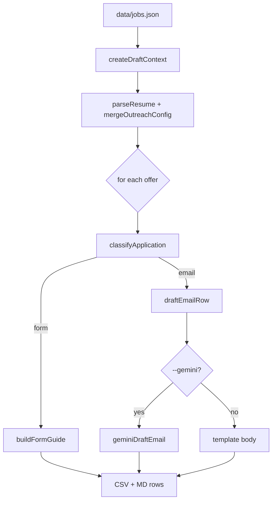

# Draft pipeline deep dive

How `raven draft` turns discovered jobs into tailored application artifacts.

**CLI module:** `jobs/draft-outreach.mjs`  
**Core logic:** `jobs/lib/draft-engine.mjs`  
**Input:** `data/jobs.json` (or `--input`)  
**Output:** `drafts/outreach-*.csv`, `.md`, optional `.xlsx`

---

## TL;DR

For each job offer, Raven:

1. Classifies **email** vs **form** application path from URL/ATS
2. Tailors resume bullets to job title keywords
3. Builds either an **outreach email** (template + optional Gemini) or **ATS form guide** (step-by-step)
4. Writes reviewable CSV/Markdown — send is a separate step

**Zero LLM by default.** Gemini is opt-in via `--gemini` or `profile.yml`.



---

## Context construction

`createDraftContext(profile, legacyOutreach, opts)`:

| Piece | Source |
|-------|--------|
| `profile` | `config/profile.yml` |
| `outreachConfig` | `mergeOutreachConfig(profile, config/outreach.yml)` |
| `resume` | `parseResume(profile)` → `files/resume.md` |
| `useGemini` | `--gemini` flag or `draft.gemini.enabled` in profile |
| `guessEmail` | `--guess-email` or outreach config |

Resume parsing extracts bullet highlights used for tailoring. Refresh with `--refresh-resume` if you edited the file mid-run.

---

## Application classification

**Module:** `jobs/lib/application-type.mjs`

`classifyApplication(offer)` → `'email'` | `'form'`

Based on job URL host and ATS type:

- Known ATS apply URLs (Greenhouse, Lever, Ashby, Workday, …) → **form** (browser application)
- Direct company pages, mailto patterns, or ambiguous hosts → **email** outreach candidate

This drives entirely different output shapes in the same CSV.

---

## Tailoring (no LLM)

**Module:** `jobs/lib/jd-tailor.mjs`

For every offer:

1. **extractJdKeywords(title)** — tokenize title into relevance keywords
2. **tailorBullets(resume highlights, offer, max_bullets)** — rank bullets by keyword overlap
3. **suggestActionWords(keywords, title)** — pick strong verbs for cover copy
4. **applyActionVerb** — prepend verb to each selected bullet

Output metadata fields (in CSV):

- `jd_keywords`
- `action_words`
- `tailored_bullets`

Configurable: `profile.resume.max_bullets` (default 3).

---

## Email path

**Module:** `jobs/lib/outreach.mjs`

`draftEmailRow(offer, outreachConfig, extras)` fills:

- `subject` — from template with `{company}`, `{title}` substitution
- `body` — intro + tailored bullets + links block
- `contact_email` — empty unless `--guess-email`

### Email guessing (`--guess-email`)

`guessContactEmail(url)`:

- Skips known job-board aggregator hosts
- Suggests `careers@<company-domain>` from apply URL hostname
- Sets `email_source: inferred` — **verify before send**

### Gemini polish (opt-in)

**Module:** `jobs/plugins/gemini-draft.mjs`

When `GEMINI_API_KEY` set and `--gemini`:

- Rewrites subject/body while preserving facts
- Sets `ai_draft: yes` | `fallback` | `no`
- On failure, keeps template draft with error note

---

## Form path

**Module:** `jobs/lib/form-guides.mjs`

For ATS applications:

- `buildFormGuideShort` → CSV `body` column (quick reference)
- `buildFormGuide` → CSV `form_steps` column (full numbered steps)

Steps are ATS-specific heuristics (which fields to expect on Greenhouse vs Lever vs Workday). User follows in browser — Raven does **not** auto-submit forms.

CSV fields:

- `application_type: form`
- `subject: Apply via form: {title} @ {company}`
- `contact_email: ''`
- `email_source: n/a`

---

## Output artifacts

| File | Purpose |
|------|---------|
| `drafts/outreach-YYYY-MM-DD.csv` | Spreadsheet for review/edit; input to `raven send` |
| `drafts/outreach-YYYY-MM-DD.md` | Human-readable review with all rows |
| `drafts/outreach-YYYY-MM-DD.xlsx` | Optional (`--xlsx`) |

Every row includes `disclaimer` from profile (legal/accuracy footer).

---

## Send integration

Only rows with `application_type: email` and valid `contact_email` are sendable.

```bash
raven send --dry-run    # preview
raven send              # Gmail/Outlook via .env OAuth
```

Form rows: user applies manually using `form_steps`.

See [cli/send.md](../cli/send.md), [drafts/README.md](../drafts/README.md).

---

## Design decisions

**Why separate discover and draft?**  
Discover is high-volume HTTP, often scheduled. Draft is profile-specific and may use paid APIs (Gemini). Splitting lets you re-draft the same `jobs.json` with different templates without re-scanning.

**Why template-first email?**  
Predictable output, no API cost, works offline. Gemini is enhancement, not requirement.

**Why form guides instead of automation?**  
ATS forms change frequently, use CAPTCHAs, and require account state. Copy/paste guides respect ToS and keep Raven local-first without storing credentials per board.

---

## Interview-style Q&A

**Q: Does draft fetch job descriptions from URLs?**  
A: Not in the default path. Tailoring uses **title** keywords. Content filters during discover may use descriptions when providers supply them.

**Q: Can I draft without running discover?**  
A: Yes — `raven draft --input path/to/jobs.json` or inline discover flags on draft command if supported.

**Q: What if resume.md is empty?**  
A: Falls back to `outreachConfig.highlights` from profile/outreach YAML.

**Q: How is Gemini prevented from inventing experience?**  
A: Prompt sends template draft + tailored bullets as grounding; disclaimer appended. User must review before send.

---

## Related

- [draft-engine.md](draft-engine.md) — module-level flow summary
- [cli/draft.md](../cli/draft.md) — flags
- [config/profile.md](../config/profile.md) — identity and templates
- [DEEP_DIVES.md](../DEEP_DIVES.md) — index
