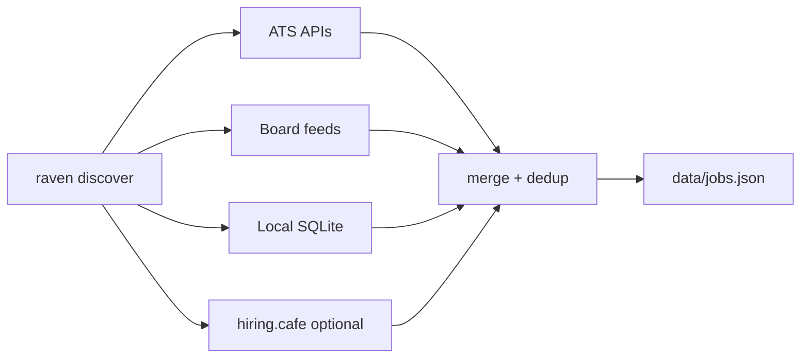

# How job discovery works

Deep dive: architecture, data flow, and what Raven does **not** do.

**Module:** `jobs/discover.mjs` · **CLI:** `raven discover`

---

## TL;DR

`raven discover` does **not** search Google or scrape arbitrary websites. It runs up to four **parallel tiers** that pull structured job data from public APIs and feeds, filters client-side, deduplicates by canonical apply URL, and saves to `data/jobs.json`.



---

## What "search" means

| Mechanism | How listings are found | Default discover? |
|-----------|------------------------|-------------------|
| ATS reverse scan | Public JSON API per company board | Yes |
| Board feeds | Aggregator APIs (RemoteOK, Remotive, …) | Yes |
| openjobdata index | SQL on `data/jobs.db` | Yes (needs sync) |
| hiring.cafe | POST search API | Opt-in |
| WebSearch / `search_queries` | Google-style `site:` queries | **Not implemented** |
| `scan_method: websearch` | Per-company handoff | **Log only** |

Zero LLM, zero browser by default.

---

## Orchestrator flow

1. Parse CLI + merge `portals.yml` filters
2. Spawn parallel tier tasks:
   - **ATS** → `scan-ats-full.mjs` (child process)
   - **Boards** → `scan.mjs --boards-only` (child process)
   - **Index** → `query-index.mjs` (in-process)
   - **hiring.cafe** → provider (in-process, env-gated)
3. `mergeDeduped()` across tiers
4. `sortOffers()` by date
5. Save `data/jobs.json`

Child processes receive filters via temp YAML at `$TMPDIR/raven-discover-<uuid>.yml` (`RAVEN_PORTALS` env).

---

## Tier 1 — ATS reverse scan

**Inversion:** instead of listing companies in YAML, Raven walks **public company directories** per ATS platform and hits each slug's public jobs API.

```
slug → careers_url → provider.fetch() → title/location filter → dedup
```

- **12 platforms:** Greenhouse, Lever, Ashby, Workday, Rippling, Workable, BambooHR, SmartRecruiters, Recruitee, Pinpoint, Teamtailor, Personio
- **Concurrency:** ~20 parallel HTTP requests per platform
- **Default cap:** 150 companies per platform (`--limit`)
- **Slug sources:** `data/cache/ats-companies/` or GitHub job-board-aggregator dataset

Example: Greenhouse → `GET boards-api.greenhouse.io/v1/boards/{slug}/jobs` (no auth).

Stale postings outside `--since` are dropped when `postedAt` is known.

---

## Tier 2 — Board feeds

Single HTTP call per aggregator, then client-side title/location filter:

| Board | API |
|-------|-----|
| RemoteOK | `remoteok.com/api` |
| Remotive | `remotive.com/api/remote-jobs` |
| Arbeitnow | `arbeitnow.com/api/job-board-api` |
| Landing.jobs | `landing.jobs/api/v1/jobs` |

---

## Tier 3 — Local index

`raven sync-jobs` downloads openjobdata → `data/jobs.db`. `query-index.mjs` runs SQL + JS filters.

---

## Filtering

Shared module: `jobs/lib/filters.mjs`

- **Title:** ≥1 positive AND 0 negatives (substring, case-insensitive)
- **Location:** empty → pass; `always_allow` → pass; `block` → reject; `allow` must match if non-empty
- **Recency:** `--since N` — missing dates pass conservatively

---

## Web search: config only

`portals.yml` may define `search_queries` and `scan_method: websearch`. **Neither is executed by discover today.**

- `search_queries` — no code reads this array
- `websearch` companies — `scan.mjs` prints "Agent/WebSearch handoff" hints only

See [Scan strategies →](scan-strategies/) for the full 4-level strategy matrix.

---

## Interview Q&A

**Why parallel tiers?** Latency — ATS scan can take minutes; boards and index are fast.

**Why child processes for ATS/boards?** Reuse standalone scan CLIs with isolated stdout JSON contract.

**How to add a source?** New `jobs/providers/*.mjs` + register in scan-ats or scan.mjs.

**Does discover use Playwright?** Not by default. Optional `--liveness` on `scan-ats` only.

---

## Related

- [Sources & tiers](sources/)
- [Scan strategies](scan-strategies/)
- [Filters](filters/)
- [discover command](../commands/discover/)
